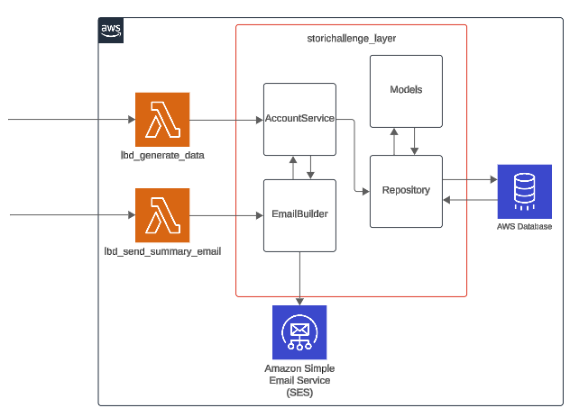

# Stori Challenge

## Problem to solve:

Send summary email that send to the user the following info:

* Total balance
* Number of transactions in July
* Number of transactions in August
* Average debit amount
* Average credit amount

## Solution

### Architecture

The solution presented is based on DDD Architecture (Domain Driven Design). 

The concept can be seen here:



It's is comprised of Go code divided in 2 main parts: 

1. A **layer in AWS** that contains the access of information in the DB as well to perform creation and update of that information. This information will be used by ...

2. The **AWS lambdas** lbd_generate_data and lbd_send_summary_mail that import that layer and use ir for generating random data for testing (in the case of 1st lambda) or for triggering the summary email send process (in the case of 2nd lambda)

Apart from that the solution also comprises a MariaDB for storing information. This information is divided in the following tables

* Account: Keeps the information of the customer and the account current balance.

* Balance: Keeps information of the balance per month of the account.

* Transaction: Keeps information of the transaction done, being this credit (money input) and debit (money output) into/from the account.

```sql


CREATE TABLE `account` (
  `id` int(11) NOT NULL AUTO_INCREMENT,
  `account_number` varchar(20) NOT NULL,
  `name` varchar(100) NOT NULL,
  `last_name` varchar(100) NOT NULL,
  `age` int(11) DEFAULT NULL CHECK (`age` >= 0),
  `email` varchar(255) DEFAULT NULL,
  `current_balance_amt` bigint(20) DEFAULT 0,
  PRIMARY KEY (`id`),
  UNIQUE KEY `account_number` (`account_number`),
  UNIQUE KEY `email` (`email`)
) ENGINE=InnoDB DEFAULT CHARSET=utf8mb4 COLLATE=utf8mb4_unicode_ci;


CREATE TABLE `balance` (
  `account_id` int(11) NOT NULL,
  `month` varchar(7) NOT NULL,
  `amt` bigint(20) NOT NULL,
  PRIMARY KEY (`account_id`,`month`),
  CONSTRAINT `balance_ibfk_1` FOREIGN KEY (`account_id`) REFERENCES `account` (`id`) ON DELETE CASCADE
) ENGINE=InnoDB DEFAULT CHARSET=utf8mb4 COLLATE=utf8mb4_unicode_ci;

CREATE TABLE `transaction` (
  `id` int(11) NOT NULL AUTO_INCREMENT,
  `account_id` int(11) NOT NULL,
  `month` varchar(7) NOT NULL,
  `dt` datetime NOT NULL,
  `amt` bigint(20) NOT NULL,
  PRIMARY KEY (`id`),
  KEY `account_id` (`account_id`,`month`),
  CONSTRAINT `transaction_ibfk_1` FOREIGN KEY (`account_id`, `month`) REFERENCES `balance` (`account_id`, `month`) ON DELETE CASCADE
) ENGINE=InnoDB DEFAULT CHARSET=utf8mb4 COLLATE=utf8mb4_unicode_ci;

```

The solution may also have an SMTP service for sending the mail. This could be Amazon Simple Email Service or whatever service you want to use.

## How to build

### Step 1

Migrate the DB into AWS Database or any other DB service. Yoy may use the sql file stori_db.sql file to perform the migration

### Step 2

Establish an STMP server for email sending

### Step 3

Clone the project into your local computer

### Step 4

Set the following env variables in your coumputer

* **AWS_ACCOUNT:** AWS Account used for deploying with CDK

* **AWS_REGION:** AWS Region in which you want to deploy with CDK

### Step 5

Run ***cdk deploy*** at terminal on root of the project

### Step 6

Set in AWS the following environment env variables:

#### DB

* **DB_USER:** Database user for the application.
* **DB_PASSWORD:** Database password for that user.
* **DB_HOST:** Host of the Database (uri)
* **DB_PORT:** Port for communication with database in the host
* **DB_NAME:** Database name

#### SMTP

* **SMTP_HOST:** Host where the SMTP service is for emailing (uri)
* **SMTP_PORT:** Port for communcation with SMTP service
* **SMTP_USERNAME:** SMTP user for the application.
* **SMTP_PASSWORD:** SMTP password for that user.

## Testing

You may test is straight with the lambda or connect with AWS API Gateway for triggering lambda events using HTTP.


